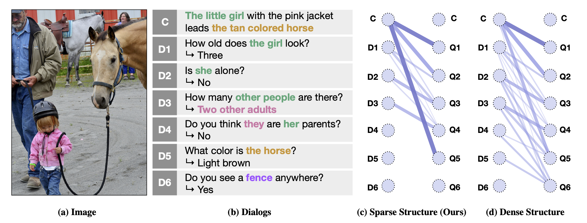

SGLKT-VisDial
====================================

Pytorch Implementation for the paper:

**[Reasoning Visual Dialog with Sparse Graph Learning and Knowledge Transfer][1]** <br>
[Gi-Cheon Kang](https://gicheonkang.com), Junseok Park, [Hwaran Lee](https://hwaranlee.github.io), [Byoung-Tak Zhang](https://bi.snu.ac.kr/~btzhang/)<sup>\*</sup>, and [Jin-Hwa Kim](http://wityworks.com)<sup>\*</sup> (\* corresponding authors) <br>
In EMNLP 2021 Findings

<!---->


Setup and Dependencies
----------------------
This code is implemented using PyTorch v1.0+, and provides out of the box support with CUDA 9+ and CuDNN 7+. Anaconda/Miniconda is the recommended to set up this codebase: <br>

1. Install Anaconda or Miniconda distribution based on Python3+ from their [downloads' site][2].
2. Clone this repository and create an environment:

```shell
git clone https://www.github.com/gicheonkang/sglkt-visdial
conda create -n visdial-ch python=3.6

# activate the environment and install all dependencies
conda activate sglkt
cd sglkt-visdial/
pip install -r requirements.txt

# install this codebase as a package in development version
python setup.py develop
```

Download Data
----------------------
1. We used the Faster-RCNN pre-trained with Visual Genome as image features. Download the image features below, and put each feature under `$PROJECT_ROOT/data/{SPLIT_NAME}_feature` directory. We need `image_id` to RCNN bounding box index file (`{SPLIT_NAME}_imgid2idx.pkl`) because the number of bounding box per image is not fixed (ranging from 10 to 100).

  * [`train_btmup_f.hdf5`][3]: Bottom-up features of 10 to 100 proposals from images of `train` split (32GB). 
  * [`val_btmup_f.hdf5`][4]: Bottom-up features of 10 to 100 proposals from images of `validation` split (0.5GB).
  * [`test_btmup_f.hdf5`][5]: Bottom-up features of 10 to 100 proposals from images of `test` split (2GB).

2. Download the pre-trained, pre-processed word vectors from [here][6] (`glove840b_init_300d.npy`), and keep them under `$PROJECT_ROOT/data/` directory. You can manually extract the vectors by executing `data/init_glove.py`.

3. Download visual dialog dataset from [here][7] (`visdial_1.0_train.json`, `visdial_1.0_val.json`, `visdial_1.0_test.json`, and `visdial_1.0_val_dense_annotations.json`) under `$PROJECT_ROOT/data/` directory.     

4. Download the additional data for Sparse Graph Learning and Knowledge Transfer under `$PROJECT_ROOT/data/` directory.

  * [`visdial_1.0_train_coref_structure.json`][8]: structural supervision for `train` split.
  * [`visdial_1.0_val_coref_structure.json`][9]: structural supervision for `val` split.
  * [`visdial_1.0_test_coref_structure.json`][10]: structural supervision for `test` split.
  * [`visdial_1.0_train_dense_labels.json`][11]: pseudo labels for knowledge transfer.
  * [`visdial_1.0_word_counts_train.json`][12]: word counts for `train` split.   


Training
--------

Train the model provided in this repository as:

```shell
python train.py --gpu-ids 0 1 # provide more ids for multi-GPU execution other args...
```

### Saving model checkpoints

This script will save model checkpoints at every epoch as per path specified by `--save-dirpath`. Default path is `$PROJECT_ROOT/checkpoints`.

Evaluation
----------

Evaluation of a trained model checkpoint can be done as follows:

```shell
python evaluate.py --load-pthpath /path/to/checkpoint.pth --split val --gpu-ids 0 1
```
Validation scores can be checked in offline setting. But if you want to check the `test split` score, you have to submit a json file to [EvalAI online evaluation server][13]. You can make json format with `--save_ranks=True` option.

Pre-trained model & Results
--------
We provide the pre-trained models for [SGL+KT][14] and [SGL][15]. <br>
To reproduce the results reported in the paper, please run the command below.
```shell
python evaluate.py --load-pthpath SGL+KT.pth --split test --gpu-ids 0 1 --save-ranks True
```

Performance on `v1.0 test-std` (trained on `v1.0` train):

  Model  |  Overall | NDCG   |  MRR   |  R@1  | R@5  |  R@10   |  Mean  |
 ------- | ------ | ------ | ------ | ------ | ------ | ------ | ------ |
  SGL+KT | 65.31 | 72.60 | 58.01 | 46.20 | 71.01 | 83.20 | 5.85

License
--------
MIT License

Acknowledgements
--------
We use [Visual Dialog Challenge Starter Code][16] and [MCAN-VQA][17] as reference code.   

[1]: https://gicheonkang.com
[2]: https://conda.io/docs/user-guide/install/download.html
[3]: https://drive.google.com/file/d/1NYlSSikwEAqpJDsNGqOxgc0ZOkpQtom9/view?usp=sharing
[4]: https://drive.google.com/file/d/1NI5TNKKhqm6ggpB2CK4k8yKiYQE3efW6/view?usp=sharing
[5]: https://drive.google.com/file/d/1BXWPV3k-HxlTw_k3-kTV6JhWrdzXsT7W/view?usp=sharing
[6]: https://drive.google.com/file/d/125DXSiMwIH054RsUls6iK3kdZACrYodJ/view?usp=sharing
[7]: https://visualdialog.org/data
[8]: https://drive.google.com/file/d/13zHOlOvijYehE3OYCD1CO23-jrY3mg8N/view?usp=sharing
[9]: https://drive.google.com/file/d/1j7x3VVhkkFnnKztx_FMjtBl2qg28BrJk/view?usp=sharing
[10]: https://drive.google.com/file/d/16N5pqwMqUVY2-vASy6LKZ7YoEMdv2bSy/view?usp=sharing
[11]: https://drive.google.com/file/d/1iCo7xomj8MLbQZO3bS1MOm01brDOlWgQ/view?usp=sharing
[12]: https://drive.google.com/file/d/13vDB0IS9rDJOgvhYO-62olO6pgrvwc2p/view?usp=sharing
[13]: https://eval.ai/web/challenges/challenge-page/518/overview
[14]: https://drive.google.com/file/d/1dxZEG-CnegH_zdKM6nPCAcvW_ujl464b/view?usp=sharing
[15]: https://drive.google.com/file/d/1PB8OLG6Mdb1M_YdbYkERY4RYkdgsZjmU/view?usp=sharing
[16]: https://www.github.com/batra-mlp-lab/visdial-challenge-starter-pytorch
[17]: https://github.com/MILVLG/mcan-vqa
